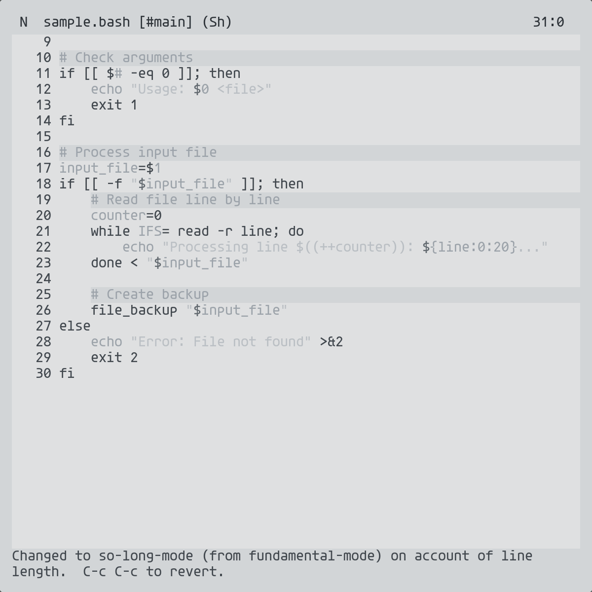

[[https://raw.githubusercontent.com/veschin/nibelung-theme/refs/heads/main/nibelung.png]]
* Why Nibelung?
Nibelung Theme is a minimalist Emacs color scheme blending cool gray tones and subtle blue accents, reminiscent of the Nebelung cat's silky fur. Designed for developers who value clarity and focus during long coding sessions.
#+begin_quote
3 AM. Brain fog. Eye strain. One thing remains sharp: your goddamn readable code.
#+end_quote
* Who is it for?
- Fans of ~doom-flatwhite~ and ~doom-plain~ seeking a fresh minimalist twist
- Developers working for hours: soft contrasts reduce eye strain
- ~Nord~ and ~gruvbox~ enthusiasts ready for a more "airy" alternative
* Features
- Comments become first-class citizens, not afterthoughts
- Great package support
  + Magit
  + Dired and Dired with git comments
  + Company
  + Doom Nano Modeline
  + Modeline
  + Matching
  + Org Mode
  + Rainbow delimiters
* Installation
** Emacs
#+begin_src emacs-lisp
;; init.el
(straight-use-package
 '(nibelung-theme :type git :host github :repo "veschin/nibelung-theme"
                  :files ("*.el")))
(load-theme 'nibelung t)
;; or
(load-theme 'nibelung-dark t)
#+end_src
** Doom Emacs
#+begin_src emacs-lisp
;; packages.el
(package! nibelung-theme
  :recipe (:host github
           :repo "veschin/nibelung-theme"
           :files ("*.el")))
;; config.el
(setq doom-theme 'nibelung)
;; or
(setq doom-theme 'nibelung-dark)
#+end_src
** package.el
#+begin_src emacs-lisp 
(use-package nibelung-theme
  :vc ( :url "https://github.com/veschin/nibelung-theme"
	:rev :newest)
  :ensure t
  :config
  (load-theme 'nibelung t)
  ;; or
  (load-theme 'nibelung-dark t))
#+end_src
** Warning
U should disable any other theme
* Other Editors
Themes for VSCode, Neovim, IntelliJ IDEA, and Alacritty are generated from the same palette. Find them in the ~dist/~ directory.
** VSCode
#+begin_src sh
git clone https://github.com/veschin/nibelung-theme.git /tmp/nibelung && \
  cp -r /tmp/nibelung/dist/vscode ~/.vscode/extensions/nibelung-theme
#+end_src
Then: ~Ctrl+K Ctrl+T~ → select "Nibelung" or "Nibelung Dark"
** Neovim
#+begin_src sh
git clone https://github.com/veschin/nibelung-theme.git /tmp/nibelung && \
  mkdir -p ~/.config/nvim/colors && \
  cp /tmp/nibelung/dist/neovim/colors/*.lua ~/.config/nvim/colors/
#+end_src
Then in ~init.lua~: ~vim.cmd("colorscheme nibelung")~ or ~vim.cmd("colorscheme nibelung-dark")~
** IntelliJ IDEA
#+begin_src sh
cp dist/intellij/*.icls ~/.config/JetBrains/*/colors/
#+end_src
Then: Settings → Editor → Color Scheme → select "Nibelung" or "Nibelung Dark"
** Alacritty
#+begin_src sh
curl -o ~/.config/alacritty/nibelung.toml \
  https://raw.githubusercontent.com/veschin/nibelung-theme/main/dist/alacritty/nibelung.toml
#+end_src
Then add to ~alacritty.toml~ under ~[general]~: ~import = ["~/.config/alacritty/nibelung.toml"]~
** Caelestia / Quickshell
#+begin_src sh
cp dist/caelestia/nibelung-dark-scheme.json ~/.local/state/caelestia/scheme.json
#+end_src
For the light variant, use ~nibelung-scheme.json~ instead. Caelestia hot-reloads the scheme automatically.
** OpenCode
#+begin_src sh
mkdir -p ~/.config/opencode/themes && \
  curl -o ~/.config/opencode/themes/nibelung.json \
  https://raw.githubusercontent.com/veschin/nibelung-theme/main/dist/opencode/nibelung.json
#+end_src
Then in ~tui.json~: ~"theme": "nibelung"~, or use the ~/theme~ command inside OpenCode. Includes both light and dark variants — OpenCode selects automatically based on your terminal.
* Preview

