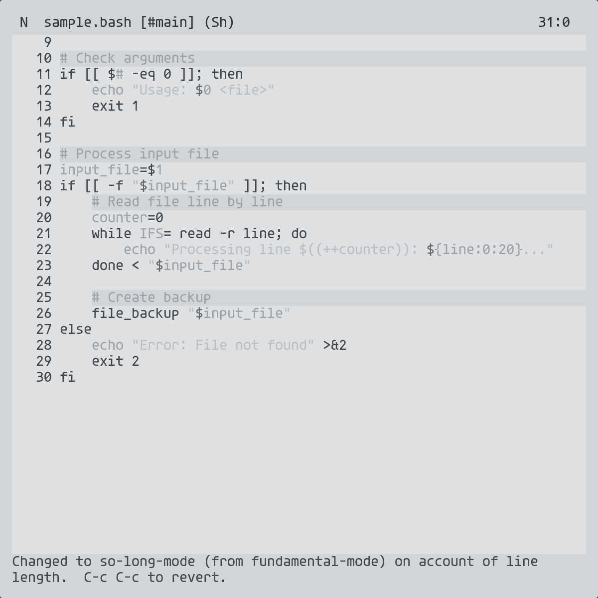

[[https://raw.githubusercontent.com/veschin/nibelung-theme/refs/heads/main/nibelung.png]]
* Why Nibelung?
Nibelung Theme is a minimalist Emacs color scheme blending cool gray tones and subtle blue accents, reminiscent of the Nebelung cat's silky fur. Designed for developers who value clarity and focus during long coding sessions.
#+begin_quote
3 AM. Brain fog. Eye strain. One thing remains sharp: your goddamn readable code.
#+end_quote
* Who is it for?
- Fans of ~doom-flatwhite~ and ~doom-plain~ seeking a fresh minimalist twist
- Developers working for hours: soft contrasts reduce eye strain
- ~Nord~ and ~gruvbox~ enthusiasts ready for a more "airy" alternative
* Features
- Light and dark variants from a single palette
- Comments become first-class citizens, not afterthoughts
- 40+ packages with explicit face definitions
  + Completion: Company, Corfu
  + Navigation: Vertico, Consult, Avy, Which-key
  + Git: Magit, Diff-HL, Git Gutter
  + Files: Dired, Diredfl, Dirvish, Treemacs
  + LSP: Eglot (with semantic tokens), LSP-UI
  + Syntax: Tree-sitter, Flycheck, Flymake
  + Org Mode, Markdown
  + Modeline: Doom Modeline, Doom Nano Modeline
  + Evil: Evil Goggles, Evil Snipe
  + Debug: Dape, Cider, EJC
  + UI: Hydra, Transient, Rainbow Delimiters, Solaire
* Preview

* Installation
#+begin_quote
All non-Emacs themes are generated from the Emacs palette via ~make export~. Light and dark variants included everywhere.
#+end_quote
** Table of Contents
- [[#emacs][Emacs]] (straight, Doom, package.el)
- [[#vscode][VSCode]]
- [[#zed][Zed]]
- [[#neovim][Neovim]]
- [[#intellij-idea][IntelliJ IDEA]]
- [[#alacritty][Alacritty]]
- [[#caelestia--quickshell][Caelestia / Quickshell]]
- [[#pi][Pi]]
- [[#omp][OMP]]
- [[#opencode][OpenCode]]
** Emacs
*** straight.el
#+begin_src emacs-lisp
(straight-use-package
 '(nibelung-theme :type git :host github :repo "veschin/nibelung-theme"
                  :files ("*.el")))
(load-theme 'nibelung t)      ; light
(load-theme 'nibelung-dark t) ; dark
#+end_src
*** Doom Emacs
#+begin_src emacs-lisp
;; packages.el
(package! nibelung-theme
  :recipe (:host github
           :repo "veschin/nibelung-theme"
           :files ("*.el")))
;; config.el
(setq doom-theme 'nibelung)      ; light
(setq doom-theme 'nibelung-dark) ; dark
#+end_src
*** package.el
#+begin_src emacs-lisp
(use-package nibelung-theme
  :vc ( :url "https://github.com/veschin/nibelung-theme"
	:rev :newest)
  :ensure t
  :config
  (load-theme 'nibelung t))
#+end_src
*** Warning
U should disable any other theme
** VSCode
#+begin_src sh
git clone https://github.com/veschin/nibelung-theme.git /tmp/nibelung && \
  cp -r /tmp/nibelung/dist/vscode ~/.vscode/extensions/nibelung-theme
#+end_src
~Ctrl+K Ctrl+T~ -> select "Nibelung" or "Nibelung Dark"
** Zed
#+begin_src sh
mkdir -p ~/.config/zed/themes && \
  curl -o ~/.config/zed/themes/nibelung.json \
  https://raw.githubusercontent.com/veschin/nibelung-theme/main/dist/zed/themes/nibelung.json
#+end_src
~Cmd/Ctrl+K Cmd/Ctrl+T~ -> select "Nibelung" or "Nibelung Dark", or set it in ~settings.json~:
#+begin_src json
{ "theme": { "mode": "system", "light": "Nibelung", "dark": "Nibelung Dark" } }
#+end_src
Zed highlight styles support per-token backgrounds, so the comment background carries over from Emacs (VSCode cannot do this).

To install as an extension instead: ~Extensions -> Install Dev Extension~ and point it at ~dist/zed~.
** Neovim
#+begin_src sh
git clone https://github.com/veschin/nibelung-theme.git /tmp/nibelung && \
  mkdir -p ~/.config/nvim/colors && \
  cp /tmp/nibelung/dist/neovim/colors/*.lua ~/.config/nvim/colors/
#+end_src
#+begin_src lua
-- init.lua
vim.cmd("colorscheme nibelung")      -- light
vim.cmd("colorscheme nibelung-dark") -- dark
#+end_src
** IntelliJ IDEA
#+begin_src sh
git clone https://github.com/veschin/nibelung-theme.git /tmp/nibelung && \
  cp /tmp/nibelung/dist/intellij/*.icls ~/.config/JetBrains/*/colors/
#+end_src
Settings -> Editor -> Color Scheme -> select "Nibelung" or "Nibelung Dark"
** Alacritty
#+begin_src sh
curl -o ~/.config/alacritty/nibelung.toml \
  https://raw.githubusercontent.com/veschin/nibelung-theme/main/dist/alacritty/nibelung.toml
curl -o ~/.config/alacritty/nibelung-dark.toml \
  https://raw.githubusercontent.com/veschin/nibelung-theme/main/dist/alacritty/nibelung-dark.toml
#+end_src
#+begin_src toml
# alacritty.toml
[general]
import = ["~/.config/alacritty/nibelung.toml"]      # light
import = ["~/.config/alacritty/nibelung-dark.toml"]  # dark
#+end_src

** Caelestia / Quickshell
#+begin_src sh
git clone https://github.com/veschin/nibelung-theme.git /tmp/nibelung && \
  cp /tmp/nibelung/dist/caelestia/nibelung-dark-scheme.json \
  ~/.local/state/caelestia/scheme.json
#+end_src
For light variant use ~nibelung-scheme.json~. Caelestia hot-reloads the scheme.
** Pi
#+begin_src sh
pi install git:github.com/veschin/nibelung-theme
#+end_src
Then choose ~nibelung~ or ~nibelung-dark~ in ~/settings~, or set it directly:
#+begin_src json
{ "theme": "nibelung" }
#+end_src
#+begin_src json
{ "theme": "nibelung-dark" }
#+end_src
Manual install:
#+begin_src sh
git clone https://github.com/veschin/nibelung-theme.git /tmp/nibelung && \
  mkdir -p ~/.pi/agent/themes && \
  cp /tmp/nibelung/dist/pi/themes/*.json ~/.pi/agent/themes/
#+end_src
Pi uses the generated semantic theme tokens for TUI chrome, messages, tools, diffs, Markdown, syntax highlighting, thinking-level borders, bash mode, and HTML export.
** OMP
#+begin_quote
OMP (Oh My Pi) is the Pi successor; themes are drop-in JSON files in ~~/.omp/agent/themes~~.
#+end_quote
#+begin_src sh
git clone https://github.com/veschin/nibelung-theme.git /tmp/nibelung && \
  mkdir -p ~/.omp/agent/themes && \
  cp /tmp/nibelung/dist/omp/themes/*.json ~/.omp/agent/themes/
#+end_src
Pick ~nibelung~ (light) or ~nibelung-dark~ under ~Appearance~ in ~/settings~, or set the slots directly:
#+begin_src sh
omp config set theme.light nibelung
omp config set theme.dark nibelung-dark
#+end_src
#+begin_src yaml
# ~/.omp/agent/config.yml
theme:
  light: nibelung
  dark: nibelung-dark
#+end_src
OMP auto-selects the slot from your terminal background. The theme drives TUI chrome, messages, tool blocks, diffs, Markdown, syntax highlighting, thinking-level borders, bash/python editor modes, the status line, and HTML export.
** OpenCode
#+begin_src sh
mkdir -p ~/.config/opencode/themes && \
  curl -o ~/.config/opencode/themes/nibelung.json \
  https://raw.githubusercontent.com/veschin/nibelung-theme/main/dist/opencode/nibelung.json
#+end_src
#+begin_src json
// tui.json
{ "theme": "nibelung" }
#+end_src
Both light and dark variants included. OpenCode selects based on terminal background.
